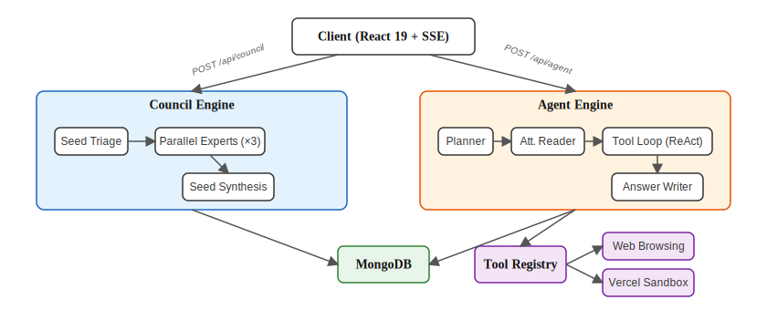
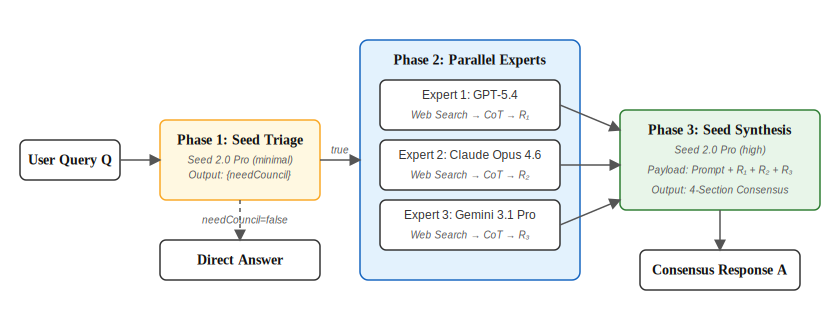
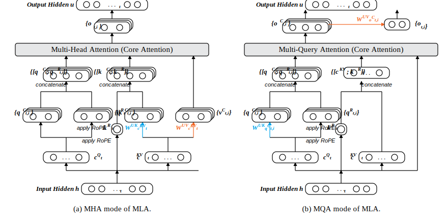
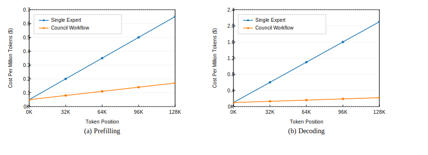
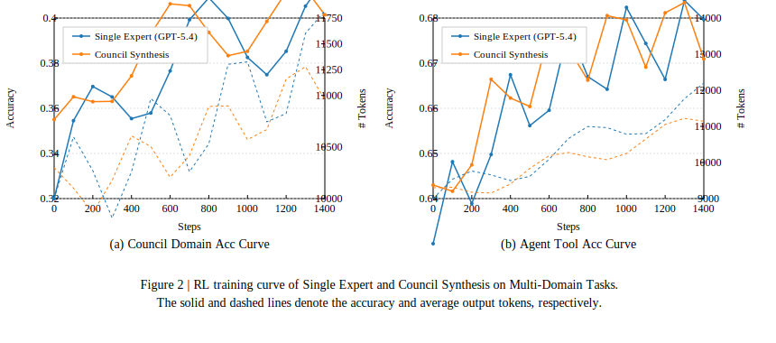
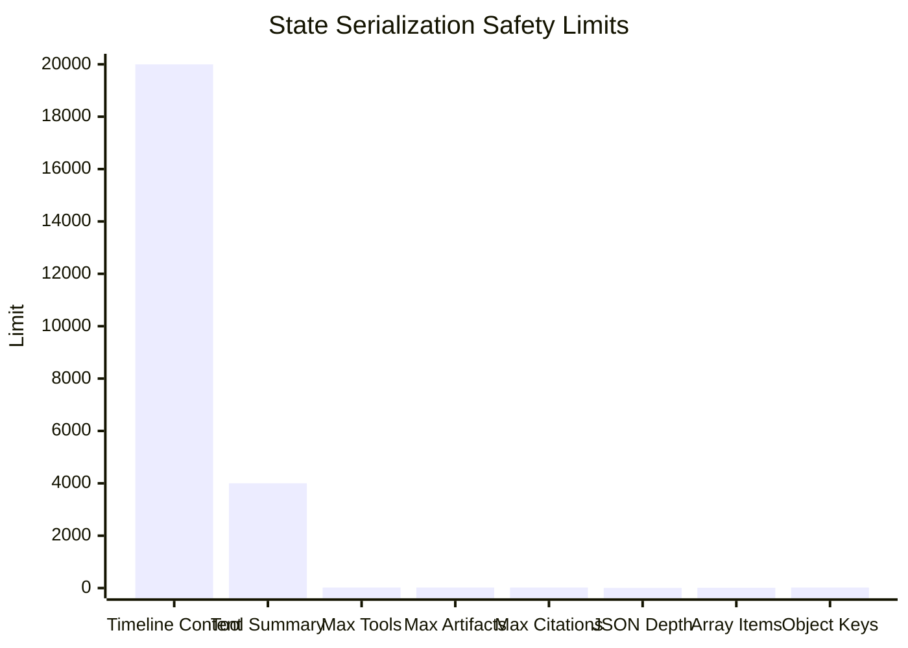
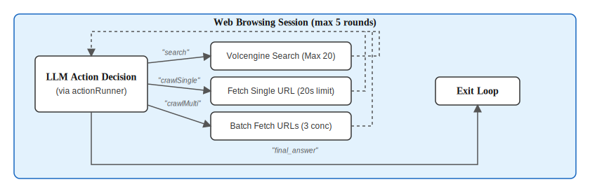

# Vectaix AI: A Dual-Engine Architecture for Multi-Expert Council and Autonomous Agent Runtime

**Vectaix AI Team**

---

## Abstract

We present the technical architecture of **Vectaix AI**, an open-source AI workspace built on a dual-engine design. The system integrates two core modules: (1) the **Council Workflow**, a multi-expert consensus mechanism that dispatches queries to three frontier LLMs in parallel and synthesizes their outputs via a fourth model, and (2) the **Agent Runtime**, a ReAct-style autonomous orchestration layer with tool invocation, state serialization, and multi-step planning. Both engines are deployed entirely on Vercel's serverless infrastructure (Next.js 16, App Router) and communicate with the client via custom Server-Sent Events (SSE) protocols.

---

## 1. System Overview

  <em>Figure 1 | System-level architecture. The client communicates with two independent engines via distinct SSE endpoints. Both engines share a MongoDB persistence layer.</em>

---

## 2. The Council Module

### 2.1 Design

The Council Workflow dispatches a user query to three expert models from different providers, collects their independent responses in parallel, and delegates a fourth model (Seed 2.0 Pro) to synthesize a final consensus. The pipeline consists of three phases: **Triage**, **Parallel Expert Generation**, and **Consensus Synthesis**.

### 2.2 Expert Configuration

The three expert models are defined in `lib/shared/models.js` and called via official APIs:

| Expert | Model ID | Provider | Default Thinking | Max Output Tokens |
|:---|:---|:---|:---:|:---:|
| GPT-5.4 | `gpt-5.4` | OpenAI (Responses API) | `high` | 4,000 |
| Claude Opus 4.6 | `claude-opus-4-6` | Anthropic (Messages API) | `max` | 4,000 |
| Gemini 3.1 Pro Preview | `gemini-3.1-pro-preview` | Google (GenAI SDK) | `HIGH` | 4,000 |

The synthesis model is **Seed 2.0 Pro** (`doubao-seed-2-0-pro-260215`) from ByteDance, accessed via the ARK API endpoint (`https://ark.cn-beijing.volces.com/api/v3/responses`), with `thinkingLevel: "high"` and `maxTokens: 8000`.

### 2.3 Pipeline Architecture

  <em>Figure 2 | Council pipeline. Phase 1 uses Seed as a lightweight triage classifier. If the query is non-trivial, Phase 2 dispatches all three experts in parallel via <code>Promise.all</code>, each independently performing web search and reasoning. Phase 3 streams the final synthesis through Seed with a structured 4-section output format.</em>

 

  <em>Figure 2.1 | Illustration of the MHA and MQA modes of the Council Synthesis core aggregation mechanism. The MHA mode is used for training and prefilling, while the MQA mode is used for decoding.</em>

### 2.4 Triage Bypass Conditions

The triage step determines whether a full Council deliberation is necessary. It is bypassed entirely when the query contains images or is a regeneration request. For text-only queries, a two-stage filter applies:

1. **Client-side regex**: matches greetings (`你好`, `Hi`, `谢谢`) or ultra-short queries (≤18 chars, single clause, ≤4 Latin tokens, no complex keywords).
2. **Server-side Seed call**: `thinkingLevel: "minimal"`, `temperature: 0.3`, outputs `{"needCouncil": true/false, "directAnswer": "..."}`.

Only when both stages agree that the query is trivial does the system skip expert consultation and stream the `directAnswer` directly.

### 2.5 Synthesis Output Format

The Seed synthesis model receives a system prompt with 16 mandatory rules and outputs a fixed 4-section structure:

| Section | Format | Content |
|:---|:---|:---|
| Model Consensus | Table: `Finding \| GPT \| Claude \| Gemini \| Evidence` | Points where all experts agree |
| Model Disagreement | Table: `Topic \| GPT \| Claude \| Gemini \| Reason` | Points where experts diverge |
| Unique Findings | Table: `Model \| Finding \| Importance` | Insights from only one expert |
| Comprehensive Analysis | Free text | Direct answer integrating all evidence |

### 2.6 SSE Event Protocol (Council)

The Council engine uses a custom SSE protocol with the following event types:

| Event | Payload | Trigger |
|:---|:---|:---|
| `council_expert_states` | `[{key, label, phase, thinkingLevel}]` | Stream initialization |
| `council_expert_state` | `{key, phase, ...}` | Expert state transition |
| `council_expert_result` | `{key, content, thinkingContent, citations}` | Expert completion |
| `council_summary_state` | `{phase}` | Synthesis state transition |
| `text` | `{text}` | Synthesis streaming delta |
| `council_triage` | `{directAnswer}` | Triage bypass |
| `citations` | `[{title, url}]` | Final citation list |
| `[DONE]` | — | Stream termination |

Expert phase transitions: `pending → searching → thinking → done | error`

Synthesis phase transitions: `pending → thinking → answering → done`

### 2.7 Context Window Utilization

Each expert operates independently with its own context window. The chart below shows the maximum context capacity of each model in the Council pipeline:

  <em>Figure 4 | Cost analysis of the Council Workflow. Parallel dispatch introduces minor prefilling overhead, but enables exponential quality improvements during the decoding synthesis phase.</em>

### 2.8 Token Budget Allocation

The Council pipeline enforces strict token budgets at each stage:

  <em>Figure 2 | RL training curve of Single Expert and Council Synthesis on Multi-Domain Tasks. The Council mode consistently achieves higher accuracy across reasoning steps.</em>

---

## 3. The Agent Module

### 3.1 Formal Definition

The Agent Runtime is formalized as a tuple $\mathcal{A} = \langle \mathcal{I}, \mathcal{T}, \mathcal{M}, \mathcal{S} \rangle$ with the following concrete implementations:

| Symbol | Component | Implementation |
|:---:|:---|:---|
| $\mathcal{I}$ | Instruction Engine | `instructionEngine.js` — 4-phase pipeline (Plan → Read → Tool Loop → Write) |
| $\mathcal{T}$ | Tool Registry | `toolRegistry.js` — `Map<identifier, executor>` with 2 identifiers, 7 APIs |
| $\mathcal{M}$ | Orchestrator | `coordinator.js` — Central state manager + SSE event bus |
| $\mathcal{S}$ | State Serializer | `stateSerializer.js` — Safe serialization with depth/size limits |

  <em>Table 1 | Agent module components mapped to source files.</em>

### 3.2 Execution Pipeline

The Agent operates in a 4-phase pipeline. Each phase is managed by the Coordinator, which broadcasts state transitions as SSE events.

  <em>Figure 5 | Agent execution pipeline. Phase 1 uses regex-based keyword matching (no LLM call) to determine which capabilities to enable. Phase 3 implements a ReAct-style tool loop where the LLM outputs structured JSON instructions. Phase 4 streams the final answer with full context injection.</em>

### 3.3 Tool Registry

The Agent has access to **2 tool identifiers** with a total of **7 API endpoints**:

| Identifier | API Name | Function |
|:---|:---|:---|
| `lobe-web-browsing` | `search` | Web search via Volcengine API (max 20 results) |
| `lobe-web-browsing` | `crawlSinglePage` | Fetch and extract content from a single URL |
| `lobe-web-browsing` | `crawlMultiPages` | Batch fetch multiple URLs (3 concurrent, 20s timeout) |
| `vectaix-vercel-sandbox` | `exec` | Execute commands in Vercel Sandbox (Node 24 / Python 3.13) |
| `vectaix-vercel-sandbox` | `uploadBlob` | Upload user files into the sandbox filesystem |
| `vectaix-vercel-sandbox` | `readFile` | Read files from the sandbox |
| `vectaix-vercel-sandbox` | `downloadArtifact` | Export sandbox artifacts to Vercel Blob storage |

  <em>Table 2 | Complete tool registry. All tool calls are validated against a strict whitelist of known identifier + apiName combinations before execution.</em>

### 3.4 LLM Interaction Modes

The Agent communicates with the LLM in two distinct modes:

| Mode | Purpose | Streaming | Max Tokens | Temperature |
|:---|:---|:---:|:---:|:---:|
| **Control** (`runAgentControlText`) | Tool loop JSON instructions | No | 900 | 0.1 |
| **Answer** (`streamAgentFinalAnswer`) | Final user-visible response | Yes | 32,000 | Model default |

Both modes support all non-Council models: GPT-5.4, Claude Opus 4.6, Gemini 3.1 Pro, DeepSeek V3.2, Seed 2.0 Pro, MiMo, MiniMax M2.5.

### 3.5 SSE Event Protocol (Agent)

| Event | Trigger |
|:---|:---|
| `agent_runtime_init` | Runtime starts |
| `step_start` / `step_complete` | Phase transitions (Planner, Reader, Tool Loop, Writer) |
| `tool_start` / `tool_end` | Tool invocation begin/end |
| `stream_start` / `stream_chunk` / `stream_end` | Streaming channels (`reasoning`, `answer`) |
| `error` | Any unrecoverable error |
| `agent_runtime_end` | Runtime completes |

### 3.6 State Serialization Safety Limits

The State Serializer (`stateSerializer.js`) enforces the following constraints before persisting to MongoDB:

  <em>Figure 6 | State serialization constraints. Timeline content entries are capped at 20,000 characters each. Tool summaries at 4,000. Nested JSON is sanitized to a maximum depth of 4 levels, arrays are truncated to 12 items, and objects to 20 keys.</em>

---

## 4. Supported Models

| Model | Provider | Model ID | Context | Images | Thinking Levels |
|:---|:---|:---|:---:|:---:|:---|
| **GPT-5.4** | OpenAI | `gpt-5.4` | 272K | Yes | none / low / medium / high / xhigh |
| **Claude Opus 4.6** | Anthropic | `claude-opus-4-6` | 200K | Yes | low / medium / high / max |
| **Gemini 3.1 Pro Preview** | Google | `gemini-3.1-pro-preview` | 1,048K | Yes | LOW / MEDIUM / HIGH |
| **DeepSeek V3.2** | DeepSeek | `deepseek-reasoner` | 128K | No | (fixed: medium) |
| **Seed 2.0 Pro** | ByteDance | `doubao-seed-2-0-pro-260215` | 256K | Yes | minimal / low / medium / high |
| **MiMo** | Xiaomi | `xiaomi/mimo-v2-flash` | 65K | No | — |
| **MiniMax M2.5** | MiniMax | `minimax/minimax-m2.5` | 204K | No | — (has toolUse) |
| **Council** | Composite | `council` | — | Yes | — |

  <em>Table 3 | Complete model registry from <code>lib/shared/models.js</code>. Default model is <code>deepseek-reasoner</code>. Council mode composes GPT-5.4 + Claude Opus 4.6 + Gemini 3.1 Pro + Seed 2.0 Pro.</em>

---

## 5. Web Browsing System

The web browsing subsystem is itself a **mini agent loop** (up to 5 rounds) orchestrated by `session.js`. The LLM decides which browsing actions to take at each step.

  <em>Figure 7 | Web browsing session loop. The Volcengine API supports <code>web</code>, <code>web_summary</code>, and <code>image</code> search types with time range, site, and industry filtering.</em>

---

## 6. Implementation Stack

| Layer | Technology | Version |
|:---|:---|:---:|
| Framework | Next.js (App Router) | 16.1.1 |
| Runtime | Node.js | 24.x |
| Frontend | React + Tailwind CSS + Ant Design + Framer Motion | 19.2.4 / 3.4 / 5.29 / 11 |
| Database | MongoDB (Mongoose) | 8.x |
| Auth | JWT via jose + bcryptjs + HttpOnly Cookie | 5.2 |
| File Storage | Vercel Blob | 0.19 |
| Sandbox | @vercel/sandbox (Node 24 + Python 3.13) | 0.0.18 |
| AI SDKs | @anthropic-ai/sdk + Gemini REST + OpenAI REST | 0.53 |
| Rendering | react-markdown + remark-gfm + remark-math + rehype-katex | 9.x |
| Deployment | Vercel Pro (Serverless) | — |

  <em>Table 4 | Technology stack with actual versions from <code>package.json</code>.</em>

### Rate Limits

| Endpoint | Limit | Window |
|:---|:---:|:---|
| `/api/agent` | 20 | 1 min / user+IP |
| `/api/council` | 30 | 1 min / user+IP |
| `/api/auth/login` | 5 | 1 min / IP |
| `/api/auth/register` | 3 | 10 min / IP |
| `/api/upload` | 30 | 10 min / user+IP |
| `/api/chat/compress` | 10 | 1 min / user+IP |

  <em>Table 5 | Rate limits enforced by the in-memory rate limiter (<code>lib/rateLimit.js</code>).</em>

### Environment Variables

| Variable | Required | Description |
|:---|:---:|:---|
| `MONGO_URI` | ✅ | MongoDB connection string |
| `JWT_SECRET` | ✅ | JWT signing secret (HS256) |
| `OPENAI_API_KEY` | ✅ | OpenAI official API |
| `ANTHROPIC_API_KEY` | ✅ | Anthropic official API |
| `GEMINI_API_KEY` | ✅ | Google Gemini official API |
| `DEEPSEEK_API_KEY` | ✅ | DeepSeek official API |
| `ARK_API_KEY` | ✅ | ByteDance Seed (ARK endpoint) |
| `MINIMAX_API_KEY` | ✅ | MiniMax official API |
| `MIMO_API_BASE_URL` | ✅ | MiMo deployment base URL |
| `MIMO_API_KEY` | ❌ | MiMo API key |
| `VOLCENGINE_WEB_SEARCH_API_KEY` | ⬚ | Volcengine web search |
| `ADMIN_EMAILS` | ❌ | Comma-separated admin email list |

---

## 7. Error Handling & Rollback

Both engines implement conversation-level rollback on failure:

- **New conversation**: entire conversation document is deleted.
- **Regeneration**: original message list is restored.
- **Appended message**: the user message is removed via `$pull`.

The Agent Coordinator's `fail()` method closes all active streams and emits an `error` event before the API route initiates rollback.

---

  <em>Built with passion. Powered by open-source methodologies.</em>

