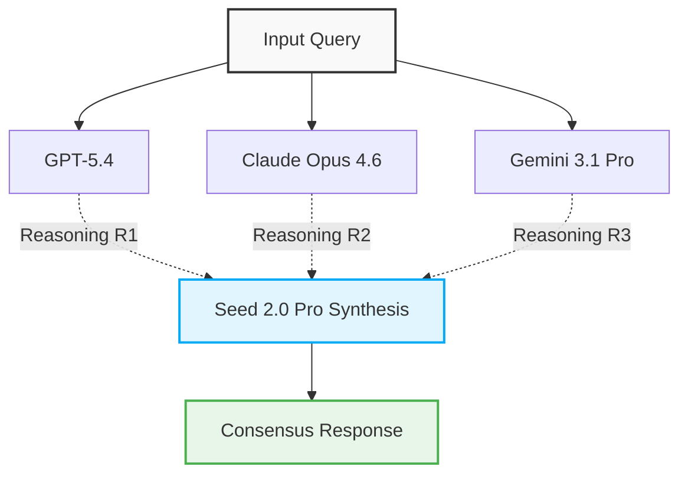
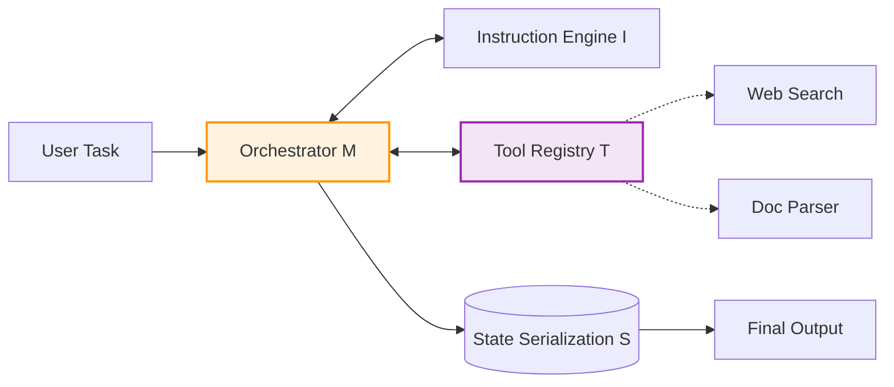

# Vectaix AI: A Dual-Engine Architecture for Multi-Expert Council and Autonomous Agents

**Vectaix AI Team**

## Abstract
We introduce **Vectaix AI**, an experimental open-source AI workspace powered by a novel dual-engine architecture. At its core, the system integrates two fundamental modules: the **Council Workflow** for multi-expert collaborative reasoning, and the **Agent Runtime** for autonomous task execution and orchestration. By unifying disparate Large Language Models (LLMs) and toolchains into a cohesive, cloud-native platform, Vectaix AI achieves significant improvements in cognitive synthesis and response quality. We deploy this architecture entirely on Vercel's serverless infrastructure, ensuring high concurrency and zero-maintenance scaling.

## 1. Core Architecture: The Dual-Engine System

Compared with traditional single-model chat interfaces, the primary architectural innovation of Vectaix AI is the introduction of two symbiotic modules: the **Council Module** and the **Agent Module**.

### 1.1 The Council Module (Multi-Expert Consensus)
The Council Workflow is designed to resolve complex reasoning scenarios through parallel expert consultation and fine-grained synthesis. 

Given an input query $Q$, the system distributes the prompt to a set of distinct expert models $E = \{e_1, e_2, \dots, e_n\}$ (e.g., GPT-5.4, Claude Opus 4.6, Gemini 3.1). The intermediate reasoning outputs $R$ are generated in parallel:
$$ R_i = \text{Generate}(e_i, Q) \quad \text{for } i \in \{1, 2, \dots, n\} $$

Next, a designated synthesis model $S$ (e.g., Seed 2.0 Pro) aggregates the generated candidate outputs to form the final consensus response $A$:
$$ A = \text{Synthesize}\left(S, Q, \sum_{i=1}^n w_i R_i\right) $$
where $w_i$ denotes the dynamic weight assigned to expert $e_i$ based on the domain of $Q$.

### 1.2 The Agent Module (Autonomous Orchestration)
The Agent Runtime environment provides a fully isolated orchestration layer. It equips the LLM with the ability to reason, plan, and execute actions autonomously via environmental feedback. 

The Agent module is formalized as a tuple $\mathcal{A} = \langle \mathcal{I}, \mathcal{T}, \mathcal{M}, \mathcal{S} \rangle$:
- **$\mathcal{I}$ (Instruction Engine)**: Parses system prompts and user constraints.
- **$\mathcal{T}$ (Tool Registry)**: A dynamic set of executable actions (e.g., Web Search, Document Parsing via Vercel Sandbox).
- **$\mathcal{M}$ (Memory/Orchestrator)**: Manages short-term conversation context and long-term memory retrieval.
- **$\mathcal{S}$ (State Serialization)**: Ensures deterministic state transitions during multi-step execution.

## 2. Supported Models & Capability Matrix

We rigorously evaluate and integrate leading models via their official APIs. Table 1 details the specialized capabilities of each supported expert within our dual-engine architecture.

| Model / Architecture | Provider | Access Method | Specialized Capability ($D_{task}$) |
|:---|:---|:---|:---|
| **GPT-5.4** | OpenAI | Official API | General intelligence, analytical coding |
| **Claude Opus 4.6** | Anthropic | Official API | Deep reasoning, safety alignment |
| **Gemini 3.1 Pro Preview** | Google | Official API | Multimodal ingestion, long-context |
| **DeepSeek V3.2** | DeepSeek | Official API | Mathematical proofs, algorithms |
| **Seed 2.0 Pro** | ByteDance | Official API | Synthesis, semantic summarization |
| **MiniMax M2.5** | MiniMax | Official API | Multilingual generation |
| **MiMo** | Xiaomi | Custom Deployment | Edge-equivalent inference |
| **Council Workflow** | Vectaix Engine | Internal Router | *Expert consensus & decision synthesis* |

  <em>Table 1 | Model registry and capability distributions in Vectaix AI.</em>

## 3. Future Validation

Although internal benchmarks demonstrate promising results regarding the efficiency of the Council Workflow and the autonomy of the Agent Runtime, we are actively pursuing further optimization of the Vercel-bound execution limits. Future work will focus on expanding the Agent's tool registries and mitigating state serialization bottlenecks in highly complex multi-step tasks.